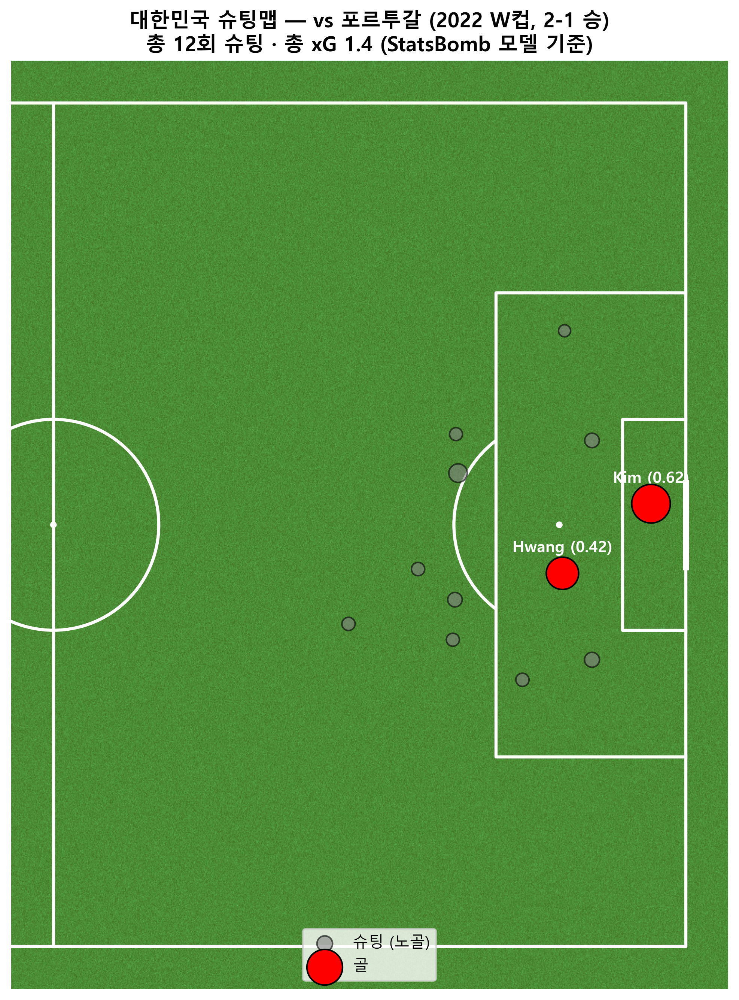

# 대한민국 vs 포르투갈 슈팅맵 (2022 카타르 월드컵)

2022 W컵 조별리그 H조, 대한민국 2-1 포르투갈 (알라이얀의 기적) 경기에서
한국의 슈팅 위치를 xG(기대득점) 기반으로 시각화한 분석입니다.

## 주요 인사이트
- 총 12회 슈팅, 총 xG 1.4 (StatsBomb 모델 기준)
- 두 골(김영권 0.62, 황희찬 0.42)이 전체 xG의 약 74%를 차지 — 양질의 기회에서 득점
- 나머지 10회 슈팅은 대부분 박스 외곽의 낮은 xG 시도

## 사용 도구
`statsbombpy` · `mplsoccer` · `pandas` · `matplotlib`

## 파일
- [`01_shotmap.ipynb`](01_shotmap.ipynb) — 분석 노트북
- `korea_portugal_xg_shotmap.png` — 결과 이미지